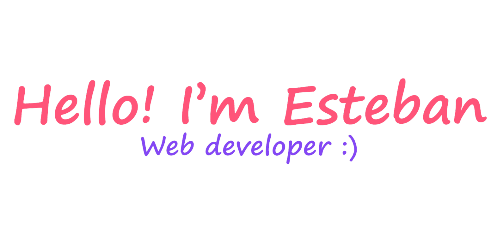

  

# 🩻 About me

I am Esteban Alvarenga, a Software Engineer with over 3 years of experience. I started programming a few years ago and studied a Technical Degree in Computer Systems Engineering. Currently, I work for one of the largest banks in the region as a full stack .net developer, and I self-study Cloud Infrastructure, Artificial Intelligence and new technologies. I am very happy to apply all my knowledge and contribute with code.

- 🔥 Passionate about development, programming, and UI design.
- 👨🏻‍💻 Full Stack .NET developer at [Stefanini Group](https://stefanini.com/es)
- 🔭 Graduate student with a Technical Degree in Systems Engineering from [ITCA-FEPADE](https://www.itca.edu.sv/)
- 🚀 Working as a developer and creating personal projects as: [Diathea 🌱](https://diathea.com/) (A SaaS for professional nutritionist), and also writing on my blog and making some content, [Official web here 🌱](https://www.estebanalvarenga.com/)

# 🌐 Conect with me

- [**📫 estebanalvarenga2018@gmail.com**](mailto:estebanalvarenga2018@gmail.com)
- [**💼 LinkedIn**](https://linkedin.com/in/alvarenga144)
- [**📚 Platzi**](https://platzi.com/p/Alvarenga144/)
